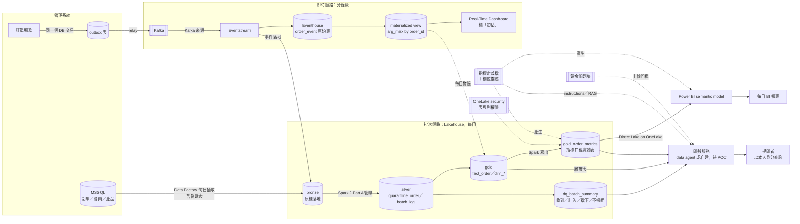

# 架構圖 v6（2026-10-26；同日被 v7 取代）

- 狀態：中間產物存檔；正本在 `part_c/README.md`
- 和 v5 的差別：MSSQL 到 bronze 的標籤從「含會員 CDC 變更」改成「含會員表」。Q10 使用者推翻先前的 CDC：「有了每日 bronze，精確到天就夠，不用承擔 CDC 的風險」

```mermaid
flowchart LR
  subgraph SRC[營運系統]
    APP[訂單服務] -->|同一個 DB 交易| OUTBOX[(outbox 表)]
    MSSQL[(MSSQL<br/>訂單／會員／產品)]
  end

  OUTBOX -->|relay| KAFKA[[Kafka]]

  subgraph RT[即時鏈路：分鐘級]
    KAFKA -->|Kafka 來源| ES[Eventstream]
    ES --> RAW[(Eventhouse<br/>order_event 原始表)]
    RAW --> MV[(materialized view<br/>arg_max by order_id)]
    MV --> RTD[Real-Time Dashboard<br/>標「初估」]
  end

  subgraph LH[批次鏈路：Lakehouse，每日]
    MSSQL -->|Data Factory 每日抽取<br/>含會員表| BRONZE[(bronze<br/>原樣落地)]
    BRONZE -->|Spark：Part A 管線| SILVER[(silver<br/>quarantine_order／batch_log)]
    SILVER --> GOLD[(gold<br/>fact_order／dim_*)]
    GOLD -->|Spark 寫出| METRICS[(gold_order_metrics<br/>指標口徑實體表)]
    SILVER --> DQ[(dq_batch_summary<br/>收到／計入／擋下／不採用)]
  end

  METRICS -->|Direct Lake on OneLake| SM[Power BI semantic model]
  SM --> PBI[每日 BI 報表]

  METRICS --> QA[問數服務<br/>data agent 或自建，待 POC]
  GOLD -->|維度表| QA
  DQ --> QA
  META[[指標定義檔<br/>＋欄位描述]] -.產生.-> METRICS
  META -.產生.-> SM
  META -.instructions／RAG.-> QA
  GQ[[黃金問題集]] -.上線門檻.-> QA
  QA --> USER[提問者<br/>以本人身分查詢]
  SEC[[OneLake security<br/>表與列權限]] -.-> METRICS

  MV -.每日對帳.-> GOLD
  ES -->|事件落地| BRONZE
```
