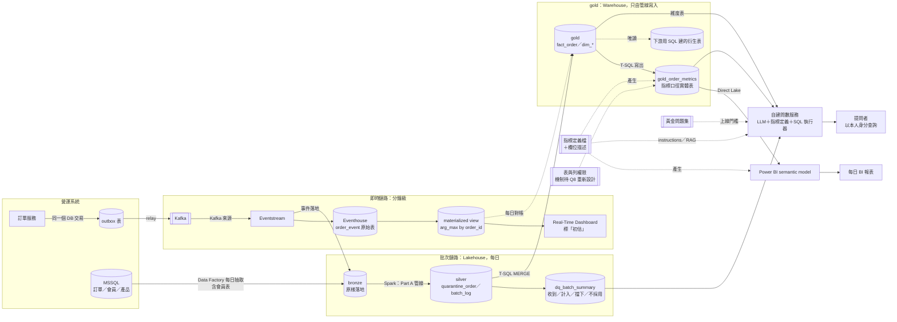

# 架構圖 v8（2026-10-26；同日被 v9 取代）

- 狀態：中間產物存檔；正本在 `part_c/README.md`
- 和 v7 的差別：Q7 使用者定案自建問數服務（「B 因為我偏好自己作」），問數方塊從「data agent 或自建，待 POC」改成「自建問數服務：LLM＋指標定義＋SQL 執行器」

```mermaid
flowchart LR
  subgraph SRC[營運系統]
    APP[訂單服務] -->|同一個 DB 交易| OUTBOX[(outbox 表)]
    MSSQL[(MSSQL<br/>訂單／會員／產品)]
  end

  OUTBOX -->|relay| KAFKA[[Kafka]]

  subgraph RT[即時鏈路：分鐘級]
    KAFKA -->|Kafka 來源| ES[Eventstream]
    ES --> RAW[(Eventhouse<br/>order_event 原始表)]
    RAW --> MV[(materialized view<br/>arg_max by order_id)]
    MV --> RTD[Real-Time Dashboard<br/>標「初估」]
  end

  subgraph LH[批次鏈路：Lakehouse，每日]
    MSSQL -->|Data Factory 每日抽取<br/>含會員表| BRONZE[(bronze<br/>原樣落地)]
    BRONZE -->|Spark：Part A 管線| SILVER[(silver<br/>quarantine_order／batch_log)]
    SILVER --> DQ[(dq_batch_summary<br/>收到／計入／擋下／不採用)]
  end

  subgraph WH[gold：Warehouse，只由管線寫入]
    GOLD[(gold<br/>fact_order／dim_*)]
    GOLD -->|T-SQL 寫出| METRICS[(gold_order_metrics<br/>指標口徑實體表)]
    GOLD -.唯讀.-> DERIVED[(下游用 SQL 建的衍生表)]
  end

  SILVER -->|T-SQL MERGE| GOLD

  METRICS -->|Direct Lake| SM[Power BI semantic model]
  SM --> PBI[每日 BI 報表]

  METRICS --> QA[自建問數服務<br/>LLM＋指標定義＋SQL 執行器]
  GOLD -->|維度表| QA
  DQ --> QA
  META[[指標定義檔<br/>＋欄位描述]] -.產生.-> METRICS
  META -.產生.-> SM
  META -.instructions／RAG.-> QA
  GQ[[黃金問題集]] -.上線門檻.-> QA
  QA --> USER[提問者<br/>以本人身分查詢]
  SEC[[表與列權限<br/>機制待 Q8 重新設計]] -.-> METRICS

  MV -.每日對帳.-> GOLD
  ES -->|事件落地| BRONZE
```
